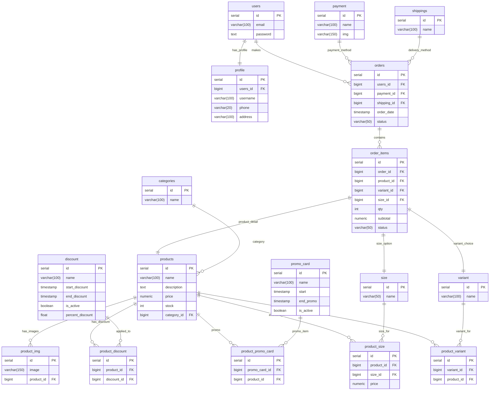

# Go e-commerce 
API untuk aplikasi front-end coffeshop, dibangun menggunakan GO (gin) dan postgreSQL 

### API ENDPOINT
| Endpoint           | Method | Deskripsi                            | Akses                |
| ------------------ | ------ | ------------------------------------ | -------------------- |
| `/auth/register`   | POST   | User mendaftar akun baru.            | Public               |
| `/auth/register`   | POST   | Admin membuatkan akun user lain.     | Admin (Bearer Token) |
| `/auth/login`      | POST   | Login akun (menghasilkan JWT Token). | Public               |
| `/auth/update/:id` | PUT    | User mengubah data dirinya.          | User (Bearer Token)  |
| `/auth/update/:id` | PUT    | Admin mengupdate data user mana pun. | Admin (Bearer Token) |
| `/admin/user`      | GET    | Melihat seluruh user terdaftar.      | Admin (Bearer Token) |

| Endpoint             | Method | Deskripsi                                    | Akses                |
| -------------------- | ------ | -------------------------------------------- | -------------------- |
| `/auth/:id/picture`  | POST   | User upload foto profil sendiri.             | User (Bearer Token)  |
| `/admin/:id/picture` | POST   | Admin upload atau mengubah foto profil user. | Admin (Bearer Token) |

| Endpoint                      | Method | Deskripsi                                                            | Akses                |
| ----------------------------- | ------ | -------------------------------------------------------------------- | -------------------- |
| `/products`                   | GET    | Mendapatkan list produk (mendukung pagination, search, dan sorting). | Public               |
| `/products/:id`               | GET    | Mendapatkan detail suatu produk.                                     | Public               |
| `/admin/product`              | POST   | Membuat produk baru.                                                 | Admin (Bearer Token) |
| `/admin/product/:id`          | PUT    | Mengupdate produk.                                                   | Admin (Bearer Token) |
| `/admin/product/:id`          | DELETE | Menghapus produk.                                                    | Admin (Bearer Token) |
| `/admin/product/:id/pictures` | POST   | Upload gambar produk.                                                | Admin (Bearer Token) |

| Endpoint                   | Method | Deskripsi                                           | Akses                |
| -------------------------- | ------ | --------------------------------------------------- | -------------------- |
| `/user/order`              | POST   | User membuat pesanan (checkout).                    | User (Bearer Token)  |
| `/user/history`            | GET    | Melihat riwayat pesanan user.                       | User (Bearer Token)  |
| `/user/order/:id`          | GET    | Melihat detail pesanan user.                        | User (Bearer Token)  |
| `/admin/orders`            | GET    | Admin melihat seluruh pesanan.                      | Admin (Bearer Token) |
| `/admin/orders/:id/status` | PUT    | Admin mengubah status pesanan (ex: Pending → Done). | Admin (Bearer Token) |

### Desain Database

### differences before using redis and after using redis
Before using Redis, data retrieval took a little longer (17ms) compared to after using Redis (2ms).

| Before | After |
| ------ | ----- |
|  |  |
